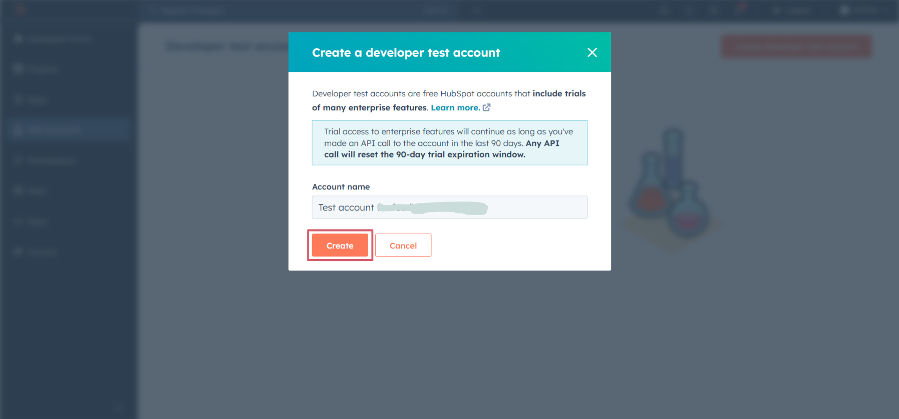
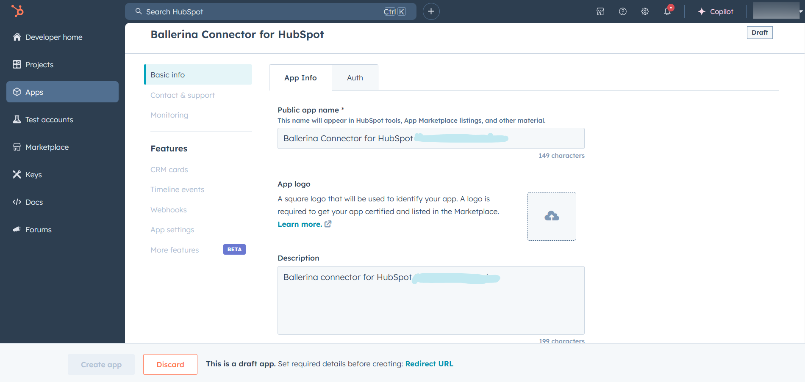

## Overview

[//]: # (TODO: Add overview mentioning the purpose of the module, supported REST API versions, and other high-level details.)
[HubSpot](https://www.hubspot.com/?hubs_content=www.hubspot.com/our-story&hubs_content-cta=null) is an inbound marketing, sales, and customer service platform offering tools for CRM, content management, email marketing, lead generation, and analytics to help businesses grow and engage customers effectively.

The `hubspot.crm.engagement.meeting` package offers APIs to connect and interact with [Meetings API](https://developers.hubspot.com/docs/reference/api/crm/engagements/meetings) endpoints, specifically based on HubSpot API v3.

## Setup guide

[//]: # (TODO: Add detailed steps to obtain credentials and configure the module.)
To use the HubSpot Meetings connector, you must have access to the HubSpot API through a HubSpot developer account and a HubSpot App under it. Therefore you need to register for a developer account at HubSpot if you don't have one already.

### Step 1: Create/Login to a HubSpot Developer Account

If you have an account already, go to the [HubSpot developer portal](https://app.hubspot.com/)

If you don't have a HubSpot Developer Account you can sign up to a free account [here](https://developers.hubspot.com/get-started)

### Step 2 (Optional): Create a [Developer Test Account](https://developers.hubspot.com/beta-docs/getting-started/account-types#developer-test-accounts) under your account

Within app developer accounts, you can create developer test accounts to test apps and integrations without affecting any real HubSpot data.

>**Note:** These accounts are only for development and testing purposes. In production you should not use Developer Test Accounts.

1. Go to Test accounts section from the left sidebar.


2. Click on the "Create developer test account" button on the top right corner.


3. In the pop-up window, provide a name for the test account and click on the `Create` button.


4. You will see the newly created test account in the list of test accounts.


### Step 3: Create a HubSpot App

1. Now navigate to the `Apps` section from the left sidebar and click on the `Create app` button on the top right corner.


2. Provide a public app name and description for your app.


### Step 4: Setup Authentication

1. Move to the `Auth` tab.


2. In the `Scopes` section, add the following scopes for your app using the `Add new scopes` button.
- `crm.objects.contacts.read`
- `crm.objects.contacts.write`


3. In the `Redirect URL` section, add the redirect URL for your app. This is the URL where the user will be redirected after the authentication process. You can use localhost for testing purposes. Then hit the `Create App` button.


### Step 5: Get the Client ID and Client Secret

Navigate to the `Auth` tab and you will see the `Client ID` and `Client Secret` for your app. Make sure to save these values.


### Step 6: Setup Authentication Flow

Before proceeding with the Quickstart, ensure you have obtained the Access Token using the following steps:

1. Create an authorization URL using the following format:

   ```
   https://app.hubspot.com/oauth/authorize?client_id=<YOUR_CLIENT_ID>&scope=<YOUR_SCOPES>&redirect_uri=<YOUR_REDIRECT_URI>
   ```

   Replace the `<YOUR_CLIENT_ID>`, `<YOUR_REDIRECT_URI>` and `<YOUR_SCOPES>` with your specific value.

2. Paste it in the browser and select your developer test account to intall the app when prompted.


3. A code will be displayed in the browser. Copy the code.

   ```
   Received code: na1-129d-860c-xxxx-xxxx-xxxxxxxxxxxx
   ```

4. Run the following curl command. Replace the `<YOUR_CLIENT_ID>`, `<YOUR_REDIRECT_URI`> and `<YOUR_CLIENT_SECRET>` with your specific value. Use the code you received in the above step 3 as the `<CODE>`.

   - Linux/macOS

     ```bash
     curl --request POST \
     --url https://api.hubapi.com/oauth/v1/token \
     --header 'content-type: application/x-www-form-urlencoded' \
     --data 'grant_type=authorization_code&code=<CODE>&redirect_uri=<YOUR_REDIRECT_URI>&client_id=<YOUR_CLIENT_ID>&client_secret=<YOUR_CLIENT_SECRET>'
     ```

   - Windows

     ```bash
     curl --request POST ^
     --url https://api.hubapi.com/oauth/v1/token ^
     --header 'content-type: application/x-www-form-urlencoded' ^
     --data 'grant_type=authorization_code&code=<CODE>&redirect_uri=<YOUR_REDIRECT_URI>&client_id=<YOUR_CLIENT_ID>&client_secret=<YOUR_CLIENT_SECRET>'
     ```

   This command will return the access token necessary for API calls.

   ```json
   {
     "token_type": "bearer",
     "refresh_token": "<Refresh Token>",
     "access_token": "<Access Token>",
     "expires_in": 1800
   }
   ```

5. Store the access token securely for use in your application.

## Quickstart

[//]: # (TODO: Add a quickstart guide to demonstrate a basic functionality of the module, including sample code snippets.)

To use the `HubSpot CRM Engagement Meeting` connector in your Ballerina application, update the `.bal` file as follows:

### Step 1: Import the module

Import the ` hubspot.crm.engagement.meeting` module and `oauth2` module.

```ballerina
import ballerina/oauth2;
import ballerinax/ hubspot.crm.engagement.meeting as meetings;
```

### Step 2: Instantiate a new connector

1. Create a `Config.toml` file and, configure the obtained credentials in the above steps as follows:

   ```toml
    clientId = <Client Id>
    clientSecret = <Client Secret>
    refreshToken = <Refresh Token>
   ```

2. Instantiate a `OAuth2RefreshTokenGrantConfig` with the obtained credentials and initialize the connector with it.

    ```ballerina 
    configurable string clientId = ?;
    configurable string clientSecret = ?;
    configurable string refreshToken = ?;
    configurable string serviceUrl = ?;

    OAuth2RefreshTokenGrantConfig auth = {
        clientId,
        clientSecret,
        refreshToken,
        credentialBearer: oauth2:POST_BODY_BEARER
    };

    ConnectionConfig config = {auth:auth};
    final meetings:Client hubspot = check new Client(config, serviceUrl);

    ```

### Step 3: Invoke the connector operation

Now, utilize the available connector operations. A sample usecase is shown below.

#### Read all Meetings
    
```ballerina
public function main() returns error? {
        meetings:CollectionResponseSimplePublicObjectWithAssociationsForwardPaging meetings = check baseClient -> /crm/v3/objects/meetings;
}
```


## Examples

The `HubSpot CRM Engagement Meeting` connector provides practical examples illustrating usage in various scenarios. Explore these [examples](https://github.com/module-ballerinax-hubspot.crm.engagement.meeting/tree/main/examples/), covering the following use cases:
